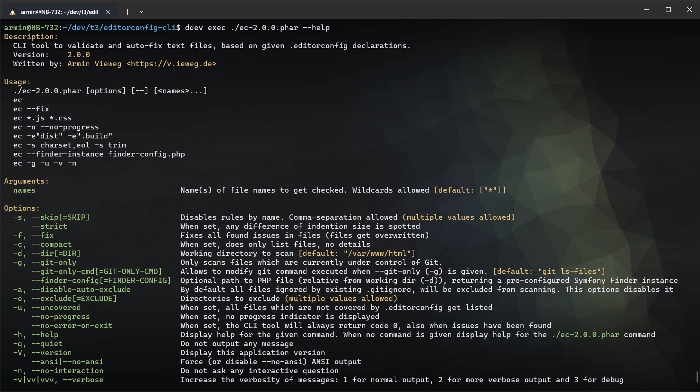

# Editorconfig Checker for CLI

[](https://github.com/a-r-m-i-n/editorconfig-cli/actions/workflows/code-checks.yml)

EditorConfigCLI (binary name ``ec``) is a free PHP-based command-line tool that **validates and auto-fixes** text files
according to your project's **.editorconfig** rules.

This ensures that your **CI pipelines and development workflows** consistently enforce all relevant ``.editorconfig``
rules automatically.

**armin/editorconfig-cli** is released under [MIT license](LICENSE).

Written by **Armin Vieweg**  <<https://v.ieweg.de>>


## Requirements

- PHP 8.2 or higher
- Enabled PHP extensions: iconv, json

If you require support for older PHP versions, you can check out and use those tags:

* [PHP 7.4, 8.0, 8.1 or 8.2](https://github.com/a-r-m-i-n/editorconfig-cli/tree/1.x) (Branch 1.x)


## Installation

You can install EditorConfigCLI by either [downloading the PHAR executable](https://github.com/a-r-m-i-n/editorconfig-cli/releases)
or installing it via Composer:

```
$ composer req --dev armin/editorconfig-cli
```

**Tip:** You can also install the tool globally using ``composer global``.

To download the PHAR executables, check out the releases section
[here](https://github.com/a-r-m-i-n/editorconfig-cli/releases).


## What is EditorConfig?


> EditorConfig helps maintain consistent coding styles for multiple developers working on the
> same project across various editors and IDEs.

The coding styles to be enforced are defined in your project’s **.editorconfig** file.

You'll find more info about syntax and features of EditorConfig on
https://editorconfig.org


## Screenshots

This screenshot shows the help page you get when calling ``ec --help``:




Here you see two example runs:


## Features

- Parsing ``.editorconfig`` file
- Validating files against corresponding ``.editorconfig`` declarations
- Several modes to iterate through your project files
- Automatic fixing of detected issues
- The following EditorConfig declarations (also called "rules") are being processed:
    - EndOfLine
    - InsertFinalNewLine
    - TrimTrailingWhitespace
    - Indention
        - Style (tab/spaces)
        - Size (width)
    - Charset (*check only*)
    - MaxLineLength (*check only*)
- Optional strict mode (``--strict``) to enforce the configured space indentation size.
  *(Note: This may conflict with other linters enforcing more granular indentation rules.)*
- Allow skipping certain rules (e.g. ``--skip charset,eol``)
- List files, currently uncovered by given ``.editorconfig`` declarations (``--uncovered``)

## Usage

Composer style:
```
$ vendor/bin/ec [options] [--] [<names>...]
```

PHAR style:
```
$ php ec-2.0.0.phar [options] [--] [<names>...]
```

### Scanning

If no options are provided, the scan starts automatically when invoking the ``ec`` binary.

EditorConfigCLI supports **three modes** for discovering files to check:

1. **By CLI arguments and options**, using a preconfigured ``symfony/finder`` instance (default mode).

   *Note:* No dotted files and directories are getting scanned (e.g. ``.ddev/`` or ``.htaccess``).
   Also, files covered by root ``.gitignore`` file, will be automatically excluded from scan.

2. **Git-based mode**, which retrieves all files tracked by Git.

   *Note:* Most CLI args and options are ignored, then. You can still filter files known to Git
   using `<names>` argument. (``--git-only``)

3. **Using a custom finder instance**, which you can provide via a separate PHP file (``--finder-config``).


### Fixing

To automatically apply fixes after scanning, append the ``--fix`` (or ``-f``) option.

Currently, two rules do not support auto-fixing:

- Charset
- MaxLineLength

You get a notice for this in result output, when such issues occur.

If an indentation issue is detected but no `indent_size` is defined, a notice is shown, since fixing indentation
requires a defined size.


## CLI

### Argument

One or more file names or patterns to check. Wildcards allowed. Default: ``['*']``

With this you can only scan certain file types, e.g.

```
$ vendor/bin/ec "*.json" "*.yml" "*.yaml"
```

This also works, when `--git-only` mode is used. Then, all files known to Git are filtered.
This is especially useful when applying `--strict` mode only to certain file types such as JSON or YAML.

#### Wildcard Expansion Notice

Shells like Bash, Zsh, and PowerShell may expand wildcards (`*`) before the tool receives them,
passing the list of matching files instead of the literal pattern.

To pass a literal `*`, quote or escape it (e.g. `"*.json"` or `\*.json`).

Use `-v` (verbose) to see the actual arguments received by the EditorConfigCLI.


### Options

The ``ec`` binary supports the following options:

| Option                     | Shortcut | Description                                                                                                                                                                         |
|----------------------------|----------|-------------------------------------------------------------------------------------------------------------------------------------------------------------------------------------|
| ``--dir``                  | ``-d``   | Define the directory to scan. By default, the current working directory is used.                                                                                                    |
| ``--exclude``              | ``-e``   | Directories to exclude from scan. Multiple and comma-separated values are allowed.                                                                                                  |
| ``--disable-auto-exclude`` | ``-a``   | Disables automatic exclusion of files listed in the root ``.gitignore`` file (if present).                                                                                          |
| ``--git-only``             | ``-g``   | Ignores all excludes and scans for all files known to Git. Requires git binary to be present.                                                                                       |
| ``--git-only-cmd``         |          | Allows you to modify the git command (incl. binary) to get file list. Default: ``git ls-files``                                                                                     |
| ``--finder-config``        |          | Allows to define a PHP file providing a custom Finder instance. [Read more](docs/CustomFinderInstance.md)                                                                           |
| ``--skip``                 | ``-s``   | Disables rules by name. Multiple and comma-separated values are allowed. See [rules list](#rules-list) below.                                                                       |
| ``--strict``               |          | When set, given indention size is forced during scan and fixing. This might conflict with more detailed indention rules, checked by other linters and style-fixers in your project. |
| ``--compact``              | ``-c``   | Shows only the files containing issues, not the issues themselves.                                                                                                                  |
| ``--uncovered``            | ``-u``   | Lists all files which are not covered by .editorconfig.                                                                                                                             |
| ``--verbose``              | ``-v``   | Shows additional information, like detailed info about internal time tracking and which binary files have been skipped.                                                             |
| ``--no-interaction``       | ``-n``   | Skips the confirmation prompt when more than 500 files are found and proceeds immediately. Always returns error code ``3``, when not confirming.                                    |
| ``--no-error-on-exit``     |          | By default ``ec`` returns code 2 when issues or code 1 when warnings occurred. When enabled, the exit code is always ``0``.                                                         |

**Tip:** The "usage" section on ``ec``'s help page shows some examples.


### Rules list

The following rules are being executed by default and could get disabled using the ``--skip`` (``-s``) option:

* ``charset``
* ``end_of_line``
* ``indent_size``
* ``indent_style``
* ``tab_width``
* ``insert_final_newline``
* ``max_line_length``
* ``trim_trailing_whitespace``


## Support and Contribution

For questions, issues, or feature requests, please visit the
[issue tracker](https://github.com/a-r-m-i-n/editorconfig-cli/issues) on Github.

If you like this project, you are welcome to support its development with
[a donation](https://www.paypal.com/cgi-bin/webscr?cmd=_s-xclick&hosted_button_id=2DCCULSKFRZFU)
to support further development. Thank you!

In case you want to contribute code, checkout the [Contribution guide](docs/Contribute.md) for developers.


## Changelog

[See here](docs/Versions.md)
