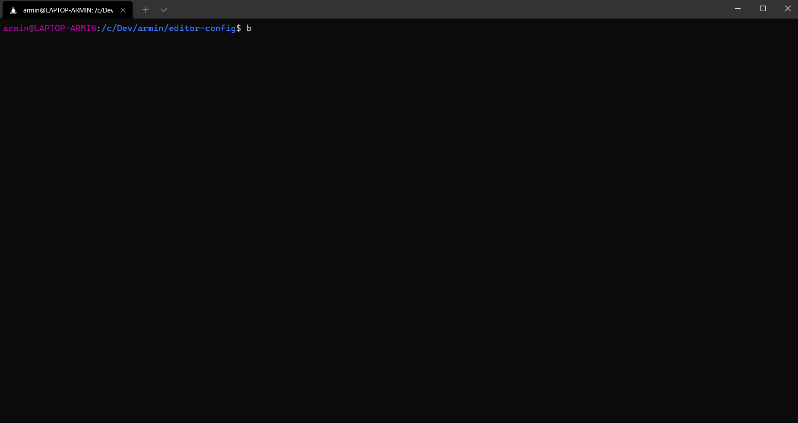

# armin/editorconfig-cli

[](https://github.com/a-r-m-i-n/editorconfig-cli/actions/workflows/code-checks.yml)

Free CLI tool (written in PHP) to **validate and auto-fix** text files based on given **.editorconfig** declarations.
This allows you to automatically ensure EditorConfig declarations during your CI and development processes.

**armin/editorconfig-cli** is released under [MIT license](LICENSE).

Written by **Armin Vieweg**  <<https://v.ieweg.de>>


## Requirements

- PHP 7.3, 7.4 or 8.0
- Enabled PHP extensions: iconv, json


## Installation

To install the editor-config CLI tool you need to [download a handy PHAR executable](https://github.com/a-r-m-i-n/editorconfig-cli/releases),
or use Composer like this:

```
$ composer req --dev armin/editorconfig-cli
```

**Tip:** You can also install packages globally with Composer (using the ``composer global`` command).

To download the PHAR executables, check out the releases section
[here](https://github.com/a-r-m-i-n/editorconfig-cli/releases).


## What is EditorConfig?


> EditorConfig helps maintain consistent coding styles for multiple developers working on the
> same project across various editors and IDEs.

Which coding styles should get applied, are configured in the **.editorconfig** file.

You'll find more info about syntax and features of EditorConfig on
https://editorconfig.org


## Screenshots

This screenshot shows the help page you get when calling ``ec --help``:


Here you see two example runs:




## Features

- Parsing .editorconfig file
- Validating files against corresponding .editorconfig declarations
    - Auto exclusion of files matching .gitignore declarations
- Tool to fix most issues automatically
- The following "rules" are existing:
    - Charset (check only)
    - EndOfLine
    - InsertFinalNewLine
    - TrimTrailingWhitespace
    - MaxLineLength (check only)
    - Indention
        - Style (tab/spaces)
        - Size (width)
- Optional strict mode (``--strict``) to force defined indent size of spaces (may conflict with other code linters)
- Allow skipping certain rules (e.g. ``--skip charset,eol``)
- List files, currently uncovered by given .editorconfig declarations (``--uncovered``)

## Usage

Composer style:
```
$ vendor/bin/ec [options] [--] [<names>...]
```

PHAR style:
```
$ php ec-1.4.0.phar [options] [--] [<names>...]
```

### Scanning

When you do not enter any options, the scan starts immediately when calling ``ec`` PHP binary.

EditorConfigCli supports **three different modes to find files** to check for:

1. **By CLI arguments and options**, which configures and utilizes a ``symfony/finder`` instance (used by default).

   *Note:* No dotted files and directories are getting scanned (e.g. ``.ddev/`` or ``.htaccess``).
   Also, files covered by root ``.gitignore`` file, will be automatically excluded from scan.

2. **Using local Git binary**, to get all files known Git. CLI args and options are ignored, then. (``--git-only``)

3. **Using a custom finder instance**, which you can provide via a separate PHP file (``--finder-config``).

### Fixing

To apply automatic fixes after scan append the ``--fix`` (or ``-f``) option.

Currently, two rules do not support auto-fixing:

- Charset
- MaxLineLength

You get a notice for this in result output, when such issues occur.


## CLI

### Argument

Name(s) of file names to get checked. Wildcards allowed. Default: ``['*']``

With this you can only scan certain file types, e.g.

```
$ vendor/bin/ec *.css *.js *.html
```


### Options

The ``ec`` binary supports the following options:

| Option | Shortcut | Description |
| ------ | -------- | ----------- |
| ``--dir`` | ``-d`` | Define the directory to scan. By default, the current working directory is used. |
| ``--exclude`` | ``-e`` | Directories to exclude from scan. Multiple values are allowed. |
| ``--disable-auto-exclude`` | ``-a`` | Disables exclusion of files ignored by root .gitignore file (when given). |
| ``--git-only`` | ``-g`` | Ignores all excludes and scans for all files known to Git. Requires git binary to be present. |
| ``--git-only-cmd`` | | Allows you to modify the git command (incl. binary) to get file list. Default: ``git ls-files`` |
| ``--finder-config`` | | Allows to define a PHP file providing a custom Finder instance. [Read more](docs/CustomFinderInstance.md) |
| ``--skip`` | ``-s`` | Disables rules by name. Multiple and comma-separated values are allowed. |
| ``--strict`` | | When set, given indention size is forced during scan and fixing. This might conflict with more detailed indention rules, checked by other linters and style-fixers in your project. |
| ``--compact`` | ``-s`` | Only shows only files with issues, not the issues itself.  |
| ``--uncovered`` | ``-u`` | Lists all files which are not covered by .editorconfig. |
| ``--verbose`` | ``-v`` | Shows additional informations. |
| ``--no-interaction`` | ``-n`` | Do not ask for confirmation, if more than 500 files found. |
| ``--no-error-on-exit`` | | By default ``ec`` returns code 2 when issues occurred. With this option set return code is always 0. |

**Tip:** The "usage" section on ``ec``'s help page shows some examples.


## Dev notes

```
$ ddev composer run all
```

### Code quality tools

```
$ ddev composer run check
$ ddev composer run fix
$ ddev composer run test
```

### Testing

```
$ ddev composer run test-with-coverage
```
Note: Xdebug must be available (``ddev xdebug on``)

The results will be located here:

- [Text Report for Unit Tests](.build/reports/phpunit-unit-results.txt)
- [Text Report for Functional Tests](.build/reports/phpunit-functional-results.txt)
- [HTML Coverage Report for Unit Tests](.build/reports/coverage-unit/index.html)
- [HTML Coverage Report for Functional Tests](.build/reports/coverage-functional/index.html)


### Compiling phar binary

```
$ ddev composer run compile
```

Note: In php.ini the option ``phar.readonly`` must be set to ``0``.


## Support

Do you have questions, issues or feature requests? Checkout the
[issue tracker](https://github.com/a-r-m-i-n/editorconfig-cli/issues) on Github.

If you like this project, you are invited to [donate some help](https://www.paypal.com/cgi-bin/webscr?cmd=_s-xclick&hosted_button_id=2DCCULSKFRZFU)
to support further development. Thank you!


## Changelog

[See here](docs/Versions.md)
