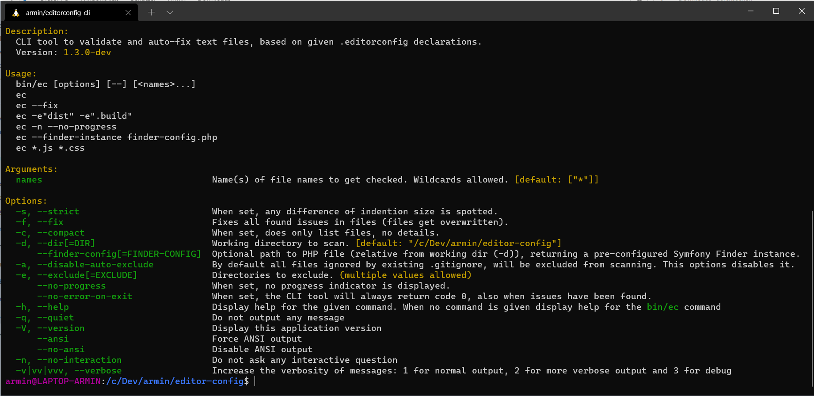

# armin/editorconfig-cli

CLI tool to validate and auto-fix text files, based on given .editorconfig declarations.


## Requirements

- PHP 7.4 or 8.0
- Enabled PHP extensions: iconv, json


## Installation

To install the editor-config CLI tool you need to download a handy PHAR executable,
or use Composer like this:

```
$ composer req --dev armin/editorconfig-cli:"^1.0"
```

**Tip:** You can also install packages globally with Composer (using the ``composer global`` command).

To download the PHAR executables, checkout the releases section [here](https://github.com/a-r-m-i-n/editorconfig-cli/releases).


## Usage

Composer style:
```
$ vendor/bin/ec --help
```

PHAR style:
```
$ php ec-1.0.0.phar --help
```


### Functionality

- Parsing .editorconfig file
- Validating every file against corresponding .editorconfig declarations
- Tool to fix issues automatically
- The following "rules" are existing:
    - Charset
    - EndOfLine
    - InsertFinalNewLine
    - TrimTrailingWhitespace
    - Indention
        - Style (tab/spaces)
        - Size (width)
- Optional strict mode to force defined indent size of spaces


### How it works

1. Counting all files in given working directory (``-d``)
2. If amount of files is greater than 500, ask user for confirmation to continue. (``-n`` for non-interactive mode)
3. Starting with scan (when ``--fix`` is **not** set). By default a visual activity indicator shows scanned files (and highlights errors). You can disable this, with ``--no-progress``.
   When ``--fix`` (or ``-f``) is set, all found issues get fixed.
4. It displays the results (to hide details of each file, you can enable the compact mode ``-c``)


### Screenshot

Here you see all arguments and options the ``ec`` CLI command provides:




## Dev notes

### Code quality tools

```
$ ddev composer run check
```
```
$ ddev composer run fix
```
```
$ ddev composer run test
```

### Compiling phar binary

```
$ ddev composer run compile
```

Note: In php.ini the option ``phar.readonly`` must be set to ``0``.


### Changelog

[See here](docs/Versions.md)
